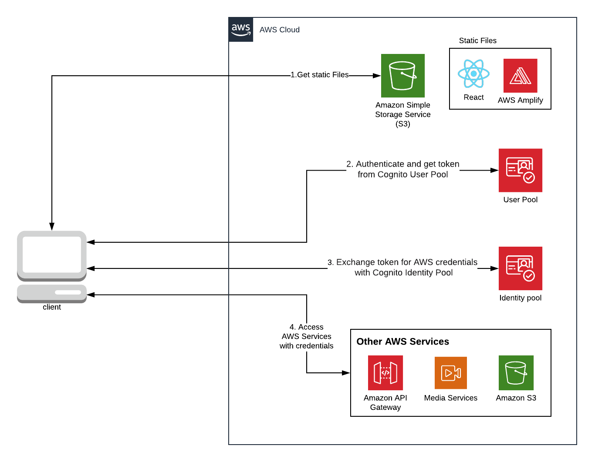

# aws-boilerplate-cognito

AWS boilerplate with AWS Cognito

## Infrastructure



## Configuration

.env file is by default present in .gitignore file.
You must rename .sample.env to .env and fill variables to make sure app retrieve them.

### Install dependencies

```bash
$ yarn or npm install
```

### Tests

Run Cypress whitout GUI using 
```bash
$ yarn run cy:run or npm run cy:run
```
Run Cypress with GUI using 
```bash
$ yarn run cy:open or npm run cy:open
```

### Amplify authentication configuration

#### With Amplify CLI

You can use Amplify CLI to configure the project, our configuration class will automatically apply the configuration that have been generate by the CLI.

#### Manually

We provide to Amplify a configuration file that can be edited inside `shared/amplify.config.ts`

```ts
export const amplifyConfig: AmplifyConfig = {
  Auth: {
    identityPoolId: process.env.REACT_APP_IDENTITY_POOL_ID,
    region: process.env.REACT_APP_REGION,
    userPoolId: process.env.REACT_APP_USER_POOL_ID,
    userPoolWebClientId: process.env.REACT_APP_USER_POOL_WEBCLIENT_ID,
  },
  language: "us",
};
```

`amplifyConfig` object is an `AmplifyConfig` interface

```ts
export interface AmplifyConfig {
  Auth: Auth;
  language?: string;
}
```

By default we provide inside `.sample.env` the required object by Amplify for the authentication configuration but if you need to add custom settings feel free to add them inside your environment file.

If you need to add a new service, for instance storage service (Amazon S3) you can create a new entry to the amplifyConfig object and create a new interface.
i.e:

```ts
export const amplifyConfig: AmplifyConfig = {
  Auth: {
    identityPoolId: process.env.REACT_APP_IDENTITY_POOL_ID,
    region: process.env.REACT_APP_REGION,
    userPoolId: process.env.REACT_APP_USER_POOL_ID,
    userPoolWebClientId: process.env.REACT_APP_USER_POOL_WEBCLIENT_ID,
  },
  Storage: {
        AWSS3: {
            bucket: '', //REQUIRED -  Amazon S3 bucket
            region: 'XX-XXXX-X', //OPTIONAL -  Amazon service region
        }
    }
  language: 'us'
};
```

For more information refers to [Amplify documentation](https://aws-amplify.github.io/docs/js/storage#manual-setup) to see required fields by Amplify for the storage service.

## Authenticator component

Authenticator component (provided by Amplify) pass the authState props to child components.
We use this authState to render or not the rest of your application

`index.tsx`

```ts
const Guard = ({ authState }: { authState?: AuthState }) => {
  if (isAuthenticated(authState || "")) {
    return <App />; // Replace App by your own App
  }
  return null;
};

const CognitoBoilerplate = () => {
  return (
    <React.StrictMode>
      <GlobalStyle />
      <Authenticator {...authenticatorConfig}>
        <Guard />
      </Authenticator>
    </React.StrictMode>
  );
};

// Wait for Amplify configuration apply
(async () => {
  await Config.getInstance().init(amplifyConfig);
  ReactDOM.render(<CognitoBoilerplate />, document.getElementById("root"));
})();
```

If the user is logged in, we render the rest of the App and so on.

**Important:**
When the state is `signedIn`, it will return a `CognitoUser` object, this `CognitoUser` is automatically passed as an authData prop to the child component

### Customization

If you want to customize the Amplify UI Theme, we have created configuration objects that map Amplify configuration properties. You can customize the following:

- UI Theme
- SignUp Configuration [Amplify SignUp Configuration](https://aws-amplify.github.io/docs/js/react#signup-configuration)
- Amplify Configuration

For more information refers to [Amplify theme customization](https://aws-amplify.github.io/docs/js/authentication#customize-ui-theme) to see all amplify cutomization settings

### Custom components

Sometimes we need to customize more than the color of the theme, this is why we shipped inside `shared/components` custom components. They inherits Amplify components, allowing you to customize what you want.

Authenticator is designed as a container for a number of Auth components. Each component does a single job, e.g., SignIn, SignUp, etc. By default, all of these elements are visible depending on the authentication state.

If you want to replace some or all of the Authenticator elements, you need to set `hideDefault: true` in `authenticatorConfig` object or fill the `amplifyHiddenComponents` array inside `amplify.config.ts`, so the component doesn’t render its default view. Then you can pass in your own set of child components that listen to authState and decide what to do.

For more information visit [Amplify documentation](https://aws-amplify.github.io/docs/js/authentication#create-your-own-ui)
